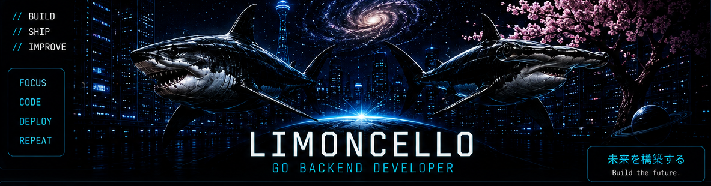
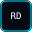
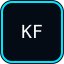
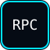
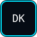

<div align="center">
  
</div>

<h1 align="center">LIMONCELLO</h1>

<p align="center">
  <strong>GO BACKEND DEVELOPER</strong><br>
  Building production-oriented backend systems with Go.
</p>

<p align="center">
  <em>未来を構築する — Build the future.</em>
</p>

---

## // TECH STACK

<table>
<tr>

<td align="center">

<br>
<b>GO</b>
</td>

<td align="center">

<br>
<b>POSTGRESQL</b>
</td>

<td align="center">

<br>
<b>REDIS</b>
</td>

<td align="center">

<br>
<b>KAFKA</b>
</td>

<td align="center">

<br>
<b>gRPC</b>
</td>

<td align="center">

<br>
<b>REST</b>
</td>

</tr>

<tr>

<td align="center">

<br>
<b>OPENAPI</b>
</td>

<td align="center">

<br>
<b>DOCKER</b>
</td>

<td align="center">

<br>
<b>COMPOSE</b>
</td>

<td align="center">

<br>
<b>JWT</b>
</td>

<td align="center">

<br>
<b>CI/CD</b>
</td>

<td align="center">

<br>
<b>TESTING</b>
</td>

</tr>

<tr>

<td align="center">

<br>
<b>SLOG</b>
</td>

<td align="center">

<br>
<b>PROMETHEUS</b>
</td>

<td align="center">

<br>
<b>GRAFANA</b>
</td>

<td align="center">

<br>
<b>GRACEFUL</b>
</td>

</tr>

</table>

---

## // CURRENTLY BUILDING

<table>
<tr>
<td align="center" width="25%"></td>
<td align="center" width="25%"></td>
<td align="center" width="25%"></td>
<td align="center" width="25%"></td>
</tr>
</table>

---

## // MISSION

```text
GO BACKEND
    │
    ▼
PRODUCTION SYSTEMS
    │
    ▼
DISTRIBUTED SYSTEMS
    │
    ▼
AI INFRASTRUCTURE
```

---

## // ARCHITECTURE

```text
CLIENT
   │
   ▼
  API
   │
   ▼
SERVICE
 ┌─┼──────────┐
 │ │          │
 ▼ ▼          ▼
REDIS    POSTGRESQL    KAFKA
```

---

## // CURRENT FOCUS

```text
BUILDING
Production-oriented Go systems

NEXT
Distributed systems
```

---

```text
SYSTEM STATUS: ONLINE
```

<div align="center">
  <sub>Building production systems with Go.</sub>
</div>
